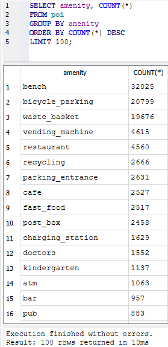

# POIneer.Render

**POIneer.Render** is the rendering component of the POIneer project. It turns selected **OpenStreetMap (OSM) PBF extracts** into **regional, offline-ready SQLite databases** that can later be consumed by the POIneer app.

The current MVP keeps the scope deliberately small: render Berlin first, import relevant OSM node POIs, migrate the SQLite schema with Flyway, and produce a deterministic `.sqlite` artifact.

---

## Table of Contents

- [Project Status](#project-status)
- [What the Renderer Does](#what-the-renderer-does)
- [Current MVP Scope](#current-mvp-scope)
- [Architecture](#architecture)
- [Repository Layout](#repository-layout)
- [Prerequisites](#prerequisites)
- [Quick Start](#quick-start)
- [Configuration](#configuration)
- [Docker Image](#docker-image)
- [Build, Test, and Coverage](#build-test-and-coverage)
- [Database Migrations](#database-migrations)
- [Development Notes](#development-notes)
- [Related Documents](#related-documents)

---

## Project Status

**Status:** actively under development.

Current focus:

- stable Berlin render pipeline for the MVP
- robust SQLite database initialization
- deterministic local and CI-friendly behavior
- simple deployment path for later VPS/Azure automation

Planned after the MVP:

- configurable multi-region rendering
- richer POI category coverage
- artifact delivery to downstream app builds
- Jenkins-based server workflows

---

## What the Renderer Does

POIneer.Render is not a server and not a mobile app. It is a command-line renderer that performs these steps:

1. Reads configured render regions from JSON.
2. Downloads the region's OSM PBF extract when it is not already available locally.
3. Optionally cuts a polygon extract through infrastructure adapters.
4. Initializes and migrates a SQLite output database with Flyway.
5. Reads OSM node POIs and maps relevant tags into the domain model.
6. Writes the final regional SQLite database to the configured output directory.

The renderer is designed to be **idempotent**: identical inputs and configuration should produce identical outputs.

---

## Current MVP Scope

Included in the MVP:

- Berlin as the first hardcoded render region
- OSM nodes only
- amenity-focused POI extraction
- SQLite output generation
- deterministic offline database artifacts
- automated unit and integration tests

Out of scope for the MVP:

- OSM ways and relations
- admin UI
- mobile app implementation
- production Azure deployment
- complex multi-region orchestration

## 📊 First Rendered Berlin POIs

The screenshot below shows the first successful query against the generated `berlin.sqlite` database.

The renderer processed real OpenStreetMap PBF data for Berlin and exported over **115,000 POIs** into an offline-ready SQLite database.

The query groups POIs by `amenity` and displays the most common categories found in the dataset.

This validates that:

- the OSM PBF reader works correctly
- amenity filtering is functioning
- POIs are successfully streamed into SQLite
- the rendering pipeline produces meaningful real-world data



---

## Architecture

The project follows a pragmatic Clean Architecture / Ports and Adapters style:

- **Domain** contains models and pure mapping logic.
- **Application** contains use cases and contracts.
- **Ports** define boundaries for input, output, rendering, and external tools.
- **Adapters** implement OSM input, downloads, polygon cutting, and SQLite output.
- **Infrastructure** contains filesystem, process execution, pathing, Flyway, and SQLite implementations.
- **CLI** is the composition root and wires services through dependency injection.

Key principles:

- domain and application logic stay independent from infrastructure details
- external tools such as Flyway and process execution are behind abstractions where useful
- filesystem-sensitive behavior is tested with isolated temporary directories
- configuration is represented by strongly typed options
- dataset rendering compute is separated from dataset storage and distribution; see
  [Hybrid Dataset Architecture](docs/architecture/hybrid-dataset-architecture.md)

---

## Repository Layout

```text
.
├─ src/POIneer.Render/                 # CLI, application, domain, ports, adapters, infrastructure
│  ├─ Cli/                             # Program entry point, runner, region configuration
│  ├─ Application/                     # Use cases and contracts
│  ├─ Domain/                          # Domain models and tag mapping
│  ├─ Ports/                           # Application boundaries
│  ├─ Adapters/                        # OSM, download, polygon cutting, SQLite export adapters
│  └─ Infrastructure/                  # Flyway, process, pathing, SQLite, temp filesystem code
├─ tests/                              # Unit, integration, contract, and helper projects
├─ migrations/                         # Flyway configuration and SQL migrations
├─ scripts/                            # Linux/macOS and Windows helper scripts
├─ docs/                               # Pull request templates and project documentation
├─ Jenkinsfile                         # CI pipeline definition
├─ global.json                         # Pinned .NET SDK version
└─ POIneerRender.sln                   # Solution file
```

---

## Prerequisites

Required:

- .NET SDK `10.0.201` as pinned in `global.json`
- Flyway CLI available on `PATH` or configured through `Flyway:Executable`

Useful for local rendering:

- network access to download Geofabrik PBF extracts
- enough disk space for downloaded `.osm.pbf` files and generated SQLite databases
- Linux/macOS shell scripts or PowerShell on Windows

Supported development platforms:

- Linux
- macOS
- Windows

CI currently targets Linux.

---

## Quick Start

### 1. Restore dependencies

```bash
dotnet restore POIneerRender.sln
```

### 2. Build

```bash
dotnet build POIneerRender.sln --configuration Release
```

### 3. Run tests

```bash
dotnet test POIneerRender.sln --configuration Release
```

### 4. Prepare local tooling

```bash
./scripts/setup-dev.sh
```

The setup script delegates Flyway installation/setup to the scripts in `scripts/flyway/`.

### 5. Run the renderer locally

Linux/macOS:

```bash
./scripts/run-dev.sh
```

Windows PowerShell:

```powershell
./scripts/run-dev.ps1
```

Development mode reads `src/POIneer.Render/appsettings.Development.json`, renders only the `berlin` region, writes work files below `data/dev/renderer-work-dir`, writes output artifacts below `data/dev/renderer-out-dir`, and publishes local artifacts below `data/dev/renderer-publish-dir`. `dotnet run --project src/POIneer.Render` uses the checked-in launch profile to select `DOTNET_ENVIRONMENT=Development`; production scripts and published artifacts set the environment explicitly.

---

## Configuration

Runtime configuration is loaded in this order:

1. `appsettings.json`
2. `appsettings.{Environment}.json`
3. environment variables with the `POINEER_RENDER__` prefix
4. command-line arguments

Relative filesystem paths in renderer configuration are resolved against the renderer content
root, normally `src/POIneer.Render` during local development. For example,
`data/dev/renderer-out-dir` resolves to `src/POIneer.Render/data/dev/renderer-out-dir`, not to
`src/POIneer.Render/bin/Debug/net10.0/data/dev/renderer-out-dir`. Absolute production paths,
such as `/opt/poineer-render/...`, are kept unchanged.

Development path roles:

| Path | Role |
| --- | --- |
| `Renderer:WorkDir` | Downloaded PBF input, cut PBF files, and per-region render state |
| `Renderer:OutDir` | Canonical generated SQLite and optional vector tile artifacts |
| `Publisher:DestinationDir` | Local publish destination when `Publisher:Target` is `Local` |
| `Temp:RootFolderName` | Folder name below the operating-system temp directory for temporary working directories |

Important renderer options:

| Option | Purpose | Development default |
| --- | --- | --- |
| `Renderer:WorkDir` | Temporary and downloaded source data | `data/dev/renderer-work-dir` |
| `Renderer:OutDir` | Final SQLite output files | `data/dev/renderer-out-dir` |
| `Renderer:RegionsJson` | Region configuration file | `Cli/config/regions.local.json` |
| `Renderer:OnlyRegionId` | Optional filter for one region | `berlin` |
| `Renderer:DryRun` | Exit after configuration/logging without rendering | `false` |
| `Renderer:LockFilePath` | Lock file preventing overlapping runs (e.g. concurrent cron executions) | `<WorkDir>/poineer-render.lock` (auto) |

Important publisher options:

| Option | Purpose | Development default |
| --- | --- | --- |
| `Publisher:Target` | Publishing implementation to use (`Local` or `AzureBlob`) | `Local` |
| `Publisher:DestinationDir` | Directory validated datasets are published to when `Publisher:Target` is `Local` | `data/dev/renderer-publish-dir` |
| `Publisher:OverwritePolicy` | What happens when a file for the same region/version already exists at the destination (`Skip`, `SkipIfIdentical`, `Overwrite`, `Fail`); `SkipIfIdentical` skips matching artifacts and fails on mismatches, while only `Overwrite` replaces existing files | `SkipIfIdentical` |
| `Publisher:SchemaVersion` | Bumped deliberately when a POIneer.Render release changes the exported schema, mapping, export logic, or dataset semantics; combined with a hash of the source PBF to form the dataset version, so unchanged input can be republished under a new version only when the rendered dataset intentionally changes | `2` |

Important Azure Blob publisher options:

| Option | Purpose | Development default |
| --- | --- | --- |
| `AzureBlobPublisher:AccountName` | Storage account name used to build the Blob service endpoint when `BlobEndpoint` is not set | `poineerstoragedev` |
| `AzureBlobPublisher:BlobEndpoint` | Optional explicit Blob service endpoint | `null` |
| `AzureBlobPublisher:ContainerName` | Blob container that stores published regional datasets | `regions` |
| `AzureBlobPublisher:MaxUploadsPerRun` | Safety limit for how many dataset blobs one renderer run may upload | `1` |
| `AzureBlobPublisher:MaxUploadBytesPerRun` | Safety limit for total uploaded dataset bytes in one renderer run | `1073741824` |

Important Flyway options:

| Option | Purpose | Default |
| --- | --- | --- |
| `Flyway:Executable` | Flyway CLI command or path | `flyway` |
| `Flyway:ConfigFileRelativePath` | Flyway TOML configuration path | `migrations/flyway-poi.toml` |
| `Flyway:Debug` | Enable verbose Flyway invocation logging | `true` |

Example environment override:

```bash
POINEER_RENDER__RENDERER__DRYRUN=true \
POINEER_RENDER__RENDERER__ONLYREGIONID=berlin \
dotnet run --project src/POIneer.Render/POIneer.Render.csproj
```

---

## Docker Image

The renderer can be packaged as a Docker image for the VPS and later Azure deployment. The
image contains the published .NET renderer, Java 21, Flyway, `osmium-tool`, and a pinned
Planetiler JAR. Runtime data and logs should be mounted from the host.

Build and dry-run verify the image:

```bash
docker build --build-arg PLANETILER_VERSION=0.10.2 -t poineer-render:local .
docker run --rm poineer-render:local --Renderer:DryRun=true
```

Run with production-style mounts:

```bash
docker run --rm \
  -v /opt/poineer-render/data:/opt/poineer-render/data \
  -v /opt/poineer-render/logs:/opt/poineer-render/logs \
  poineer-render:local
```

See [Docker Renderer Image](docs/workflows/docker-renderer.md) for details.

---

## Build, Test, and Coverage

Common commands:

```bash
dotnet restore POIneerRender.sln
```

```bash
dotnet build POIneerRender.sln --configuration Release
```

```bash
dotnet test POIneerRender.sln --configuration Release
```

Coverage helper:

```bash
./scripts/coverage.sh
```

CI intent:

- restore packages from lock files
- build the solution
- run automated tests
- collect coverage
- avoid expensive full OSM rendering in normal CI

The current minimum line coverage target is **60%**.

---

## Database Migrations

SQLite schema changes are managed through Flyway.

Relevant files:

- `migrations/flyway-poi.toml`
- `migrations/sql/poi/V1__create_poi_table.sql`

When changing migrations or Flyway path handling:

- keep paths robust across CLI, VS Code, Windows, Linux, and Jenkins
- do not rely on the current working directory unless the code already establishes it explicitly
- add or update integration tests for path-sensitive behavior
- verify that migrations are discovered and executed, not only that the Flyway schema history table exists

---

## ▶️ Run the Renderer

Run the renderer locally:

```bash
dotnet run --project src/POIneer.Render
```

The renderer will:

1. resolve configured regions
2. download and process OSM data
3. apply Flyway migrations
4. extract POIs
5. generate offline-ready SQLite databases

Current MVP production configuration renders:

- Berlin

---

## ⚙️ Configuration

Configuration is loaded from:

- `appsettings.json`
- `appsettings.{Environment}.json`
- environment variables
- command line arguments

Example:

```json
{
  "Renderer": {
    "OnlyRegionId": "berlin"
  }
}
```

Environment variables can override configuration values:

```bash
POINEER_RENDER__RENDERER__ONLYREGIONID=berlin
```

---

## 📂 Output Structure

Generated files are stored inside the configured data directories.

Example structure:

```text
data/
├─ dev/
│  ├─ work/
│  └─ out/
└─ prod/
   ├─ work/
   └─ out/
```

Example generated database:

```text
data/prod/out/berlin/poi.sqlite
```

Temporary and intermediate files are written to the corresponding `work` directory.

---

## 🚧 MVP Status

Current MVP capabilities:

- regional OSM rendering
- SQLite export
- Flyway migrations
- automated tests
- Jenkins CI
- configurable regions
- offline-ready POI database generation

Planned future features:

- scheduled region updates
- admin UI
- API layer
- mobile app integration
- multi-region rendering
- tile generation

## Development Notes

- Follow the repository-specific guidance in `AGENTS.md` before making larger changes.
- Prefer small, focused changes.
- Keep repository Markdown and code comments in English.
- Do not commit secrets or production credentials.
- Keep the MVP boundaries in mind: Berlin, nodes, SQLite, simple rendering pipeline.

---

## License

This project is intended as a learning and open-source project. The final license will be defined later.

---

## Related Documents

- [Git - Branch Flow Guide](README-GIT-FLOW.md)
- [Git - Pull Requests Flow Guide](README-GIT-PR.md)
- [Git - Handling Dependabot Branches](README-GIT-DEPENDABOT.md)
- [Tests README](tests/README.md)
- [ADR 0001: Prevent Overlapping Scheduled Renders](docs/decisions/0001-prevent-overlapping-scheduled-renders.md)
- [ADR 0002: Local Dataset Publisher](docs/decisions/0002-local-dataset-publisher.md)
- [ADR 0003: Dataset Artifact Metadata](docs/decisions/0003-dataset-artifact-metadata.md)
- [Hybrid Dataset Architecture](docs/architecture/hybrid-dataset-architecture.md)
- [Azure Dataset Storage](docs/workflows/azure-dataset-storage.md)
