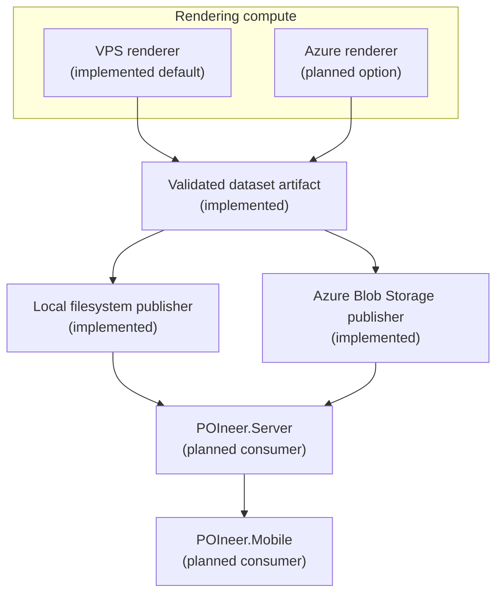

# Hybrid Dataset Architecture

POIneer separates dataset rendering from dataset storage and distribution. Rendering is a
compute workload: it reads OpenStreetMap extracts, transforms POIs, validates the generated
SQLite database, and produces a versioned dataset artifact. Storage is a publishing concern:
it keeps validated artifacts available for downstream services and apps.

This separation is intentional. POIneer does not require every workload to run in Azure. The
existing VPS can provide predictable fixed-cost rendering capacity, while Azure Blob Storage
provides scalable, independently managed dataset storage.

## Architecture Overview

The renderer should be able to run wherever suitable compute is available. The dataset
artifact should be publishable to whichever storage backend is appropriate for the current
deployment phase.

## Current Implementation

The current implementation is intentionally small and can publish to either the local
filesystem or Azure Blob Storage:

- POIneer.Render runs as a command-line renderer.
- The VPS is the initial production rendering environment.
- Jenkins builds and promotes a Docker image for scheduled VPS runs.
- Region PBF files are downloaded into the renderer work directory.
- Each rendered region produces a canonical SQLite artifact in `Renderer:OutDir`.
- Generated datasets are validated before publication.
- `LocalDatasetPublisher` publishes validated artifacts to a local filesystem destination.
- `FilePublishedDatasetVerifier` verifies published filesystem artifacts by size and SHA-256
  checksum before the run is considered successful.
- `AzureBlobDatasetPublisher` uploads validated artifacts to Azure Blob Storage when
  `Publisher:Target` is `AzureBlob`.
- `AzureBlobPublishedDatasetVerifier` verifies uploaded Blob artifacts using stored dataset
  metadata before the run is considered successful.

This is enough for the MVP and keeps rendering independent from any mandatory cloud
dependency.

## Planned Architecture

The planned architecture keeps the same boundaries while adding cloud-backed storage and,
optionally, cloud-backed compute:

- The initial storage account and dataset container are defined in `infra/azure/storage.bicep`;
  the current dev parameters use resource group `rg-poineer-dev`, storage account
  `poineerstoragedev`, and container `regions`.
- Azure compute can become an additional renderer execution environment if future workload,
  scaling, or operational requirements justify it.
- POIneer.Server can read dataset metadata and dataset artifacts from the selected publishing
  target.
- POIneer.Mobile can receive dataset availability through POIneer.Server rather than knowing
  how datasets were rendered.

Azure Blob Storage is therefore a storage option, not a requirement that rendering also moves
to Azure.

## Responsibility Boundaries

| Area | Current responsibility | Future direction |
| --- | --- | --- |
| Rendering compute | VPS runs POIneer.Render as the default scheduled renderer. | Azure may also run the renderer if useful. |
| Dataset generation | POIneer.Render downloads OSM PBF input, extracts POIs, writes SQLite, and validates output. | Same pipeline, regardless of compute environment. |
| Dataset publishing | Local filesystem publisher stores validated artifacts under `Publisher:DestinationDir`; Azure Blob publisher can store artifacts in managed object storage. | Additional publishing targets can be added behind `IDatasetPublisher` if needed. |
| Integrity verification | Filesystem verifier compares published file size and SHA-256 checksum with source artifact metadata; Azure Blob verifier compares stored Blob metadata with source artifact metadata. | Storage-specific verifier behavior can evolve with future targets. |
| Dataset consumption | No production consumer is implemented in this repository. | POIneer.Server exposes dataset availability to POIneer.Mobile. |

## Compute And Storage Separation

Rendering and storage should not be coupled:

- Moving published datasets to Azure Blob Storage does not require moving rendering to Azure.
- Moving rendering to Azure does not require changing the dataset artifact format.
- Adding new storage targets should happen behind publishing and verification abstractions.
- Adding new render environments should not change the domain model, SQLite schema, or
  downstream dataset contract by itself.

The artifact is the handoff point. Once a region has produced a validated SQLite dataset, the
publisher can copy or upload it to the configured destination, and the verifier confirms that
the destination matches the source artifact.

## Validation And Verification

POIneer uses two separate checks:

- Dataset validation checks that the generated SQLite dataset is structurally and
  semantically acceptable before it becomes the canonical artifact.
- Published dataset verification checks that the artifact at the publish destination matches
  the validated source artifact.

Both checks matter in the hybrid architecture. Validation protects consumers from invalid
render output. Verification protects consumers from incomplete, corrupted, or mismatched
published artifacts.

## Non-Goals

This document does not define:

- credentials or secret handling
- IP addresses or hostnames
- internal VPS server configuration
- detailed Azure resource provisioning
- operational runbooks
- cost figures that require frequent maintenance

Those details belong in deployment-specific documentation or infrastructure code once the
corresponding implementation exists.

## Related Documents

- [Scheduled Renderer Execution](../workflows/scheduled-renders.md)
- [Docker Renderer Image](../workflows/docker-renderer.md)
- [Azure Dataset Storage](../workflows/azure-dataset-storage.md)
- [ADR 0002: Local Dataset Publisher](../decisions/0002-local-dataset-publisher.md)
- [ADR 0003: Dataset Artifact Metadata](../decisions/0003-dataset-artifact-metadata.md)
- [ADR 0004: Verify Published Dataset Integrity](../decisions/0004-verify-published-dataset-integrity.md)
- [ADR 0005: Automated VPS Deployment](../decisions/0005-automated-vps-deployment.md)
